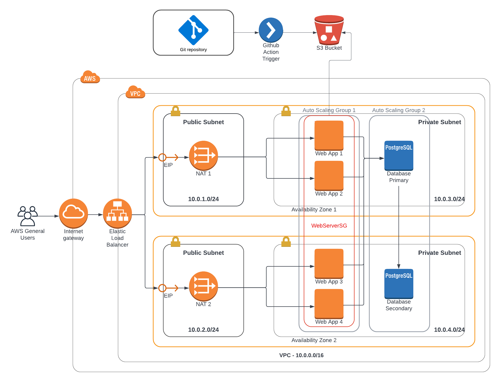

## Udagram High Availability Web App deployment using Cloud Formation

### Architecture

---------------------



<br>

### Design

A company is creating an Instagram clone called Udagram.

Developers want to deploy the application to AWS infrastructure for more thorough regession and stress testing.

The Udagram web application will be deployed using a Launch configuration consisting of - 4 servers, two instances across two private subnets across two availability zones in us-west-2.

Requirements indicate that two vCPUs and at least 4GB of RAM is required. Therefore a "t2.medium" EC2 instance will be selected.

The Operating system will be Ubuntu 18.04 LTS. The AMI will be obtained as a SSM public parameter (/aws/service/canonical/ubuntu/server/18.04/stable/current/amd64/hvm/ebs-gp2/ami-id). 

All project parameters will be stored in SSM to ensure no values are hardcoded the yml configuration.

Minimum of 10GB disk on each instance.

Load will balanced across each AZ using an application load balancer which will forward traffic on port 80 to 2 NAT gateways in public subnets. A separate elastic IP address will be assigned to both NATs.

The application backend requires a Postgressql RDS for further testing, however only a primary instance is required. A secondary readonly failover can be created manually if required.

#### Security Groups and Roles

The EC2 instances require permission to pull source code files from S3, as this is where developers will push their code to using github actions. An appropriate IAM Role will be assigned to each EC2 instance.


### Project Structure

| Name                    | Description                                                     |
|-------------------------|-----------------------------------------------------------------|
| diagrams/               | Contains architecture diagrams for the project                  |
| src/                    | Contains source code files of the website                       | 
| substacks/              | Contains cloud formation templates for each resource group      |
| .gitignore              | List of files for git to ignore                                 |
| README.md               | Documentation on the project                                    |
| bucket.sh               | Script for creating and loading the code S3 bucket              |
| project-parameters.json | List of project parameters                                      |
| udagram-stack.yml       | Parent cloud formation template which calls the substacks       |


### Project Setup

The Launch configuration expects an S3 bucket with the code placed in s3://${bucket_name}/src/

You can set this up by running. 

```
> ./bucket -c
```

Just change the relevant script parameters to your environment here:

```
# PARAMS
BUCKET_NAME="udagram-code-bucket-df001"
PROFILE_NAME="UdacityAdmin"
REGION="us-west-2"
```

Or you can uncomment the services.yml file in the parent stack "udagram-stack.yml" file:

```
  # Optional if you want to create the bucket resource through Cloud formation
  # ServiceModule:
  #   Type: AWS::CloudFormation::Stack
  #   Properties:
  #     TemplateURL: !Sub "https://${CodeBucketName}.s3.us-west-2.amazonaws.com/substacks/services.yml"
  #   DependsOn: ParamModule
```

The Parent stack also expects substacks to be uploaded to S3 here "s3://${bucket_name}/substacks/". So make sure this has been configured manually or through github actions.


### Run the project

You can run each substack individually like so:

```
> aws cloudformation create-stack --stack-name paramStack --template-body file://substacks/variables.yml --parameters file://project-parameters.json --profile UdacityAdmin
```

Or you can run the parent stack:

```
> aws cloudformation create-stack --stack-name UdagramStack --template-body file://udagram-stack.yml --parameters file://project-parameters.json --profile UdacityAdmin
```

Once the SSM parameters have been created from variables.yml, you don't need to pass the project-parameters.json file

```
> aws cloudformation create-stack --stack-name networkStack --template-body file://substacks/network.yml --profile UdacityAdmin
```


